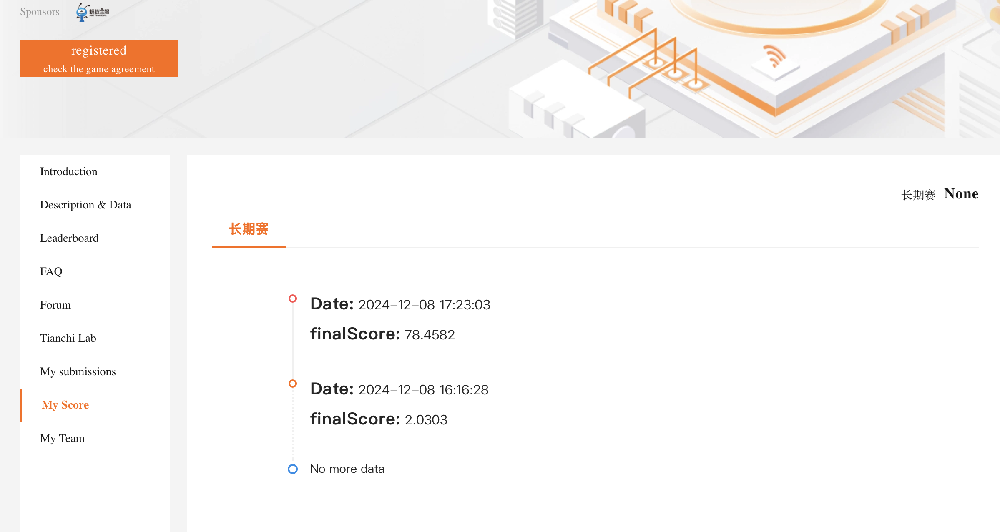

# 221275043 谢俊言 lab4
## I. spark RDD 编程
### 1. 查询特定⽇期的资⾦流⼊和流出情况：
按照日期，将所有的资金流入和流出相加即可，运行结果存储在task1_result中。
### 2. 活跃用户分析：
根据日期选择2014年8月，计算每个用户有交易记录的天数，筛选出天数大于5的用户。运行后得到的结果是12767。
## II. spark SQL 编程
### 1. 按城市统计2014年3⽉1⽇的平均余额
首先将两张表根据userid进行合并，然后根据日期2014-3-1筛选，按照城市分组计算平均值，最后降序输出，运行结果存储在task2_result/2.1中。
### 2. 统计每个城市总流量前3⾼的⽤户
首先按照时间范围筛选2014年8月，然后按城市和userid分组，计算每个用户在每个城市的总购买金额、总赎回金额和总资金流量。随后定义一个窗口规范，按“city”分区，并根据总资金流量降序排列。最后筛选前三的用户并输出，运行结果存储在task2_result/2.2中。
## III. spark ML编程
采用了Spark MLlib中的线性回归模型来预测每日的资金流入量和流出量。采用了时间相关特征，包括年份、月份、日期和星期几，以捕捉数据中的时间模式。通过使用所有的历史数据进行训练，递归地预测了2014年9月份的每日流入和流出量，运行结果存储在task3_result中，最终提交的文件为task3_result/tc_comp_predict_table.csv。提交结果如下图：

## IV. 可能的改进之处
task1.2运行耗时比起使用pandas慢很多，可以探索一些加速发生或者更高效的实现
task3可以考虑使用比线性模型更加强大的模型，目前仅使用年份、月份、日期和星期几做为特征，未来可以考虑加入一些其他的特征。